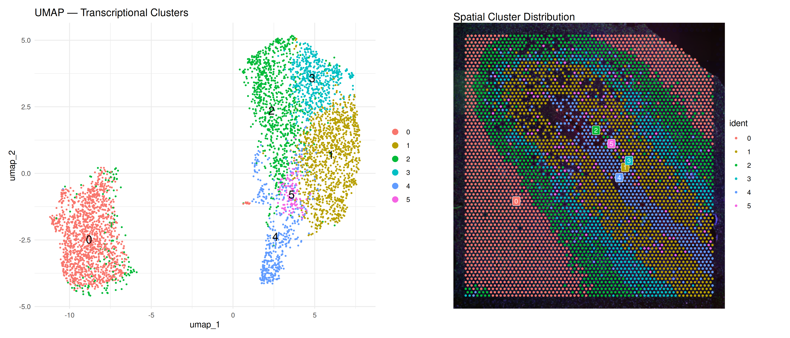
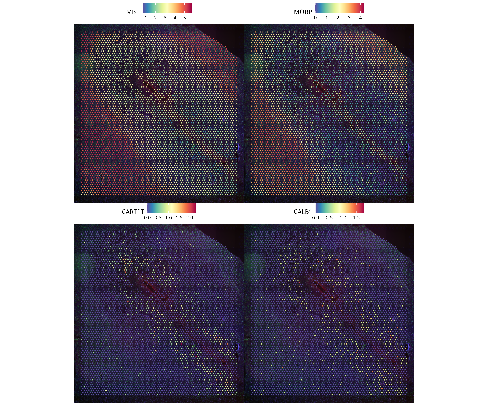
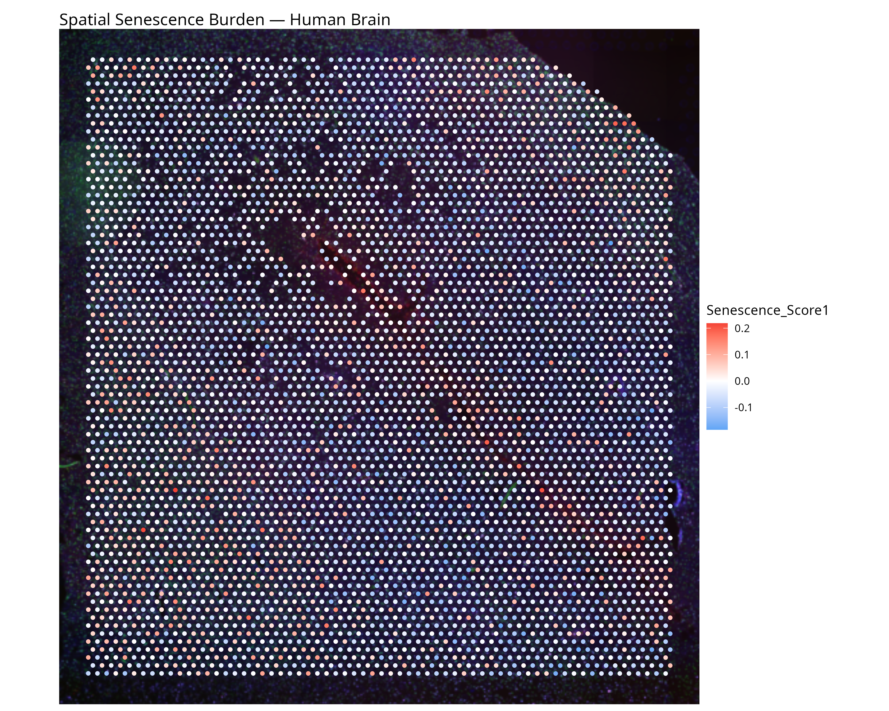
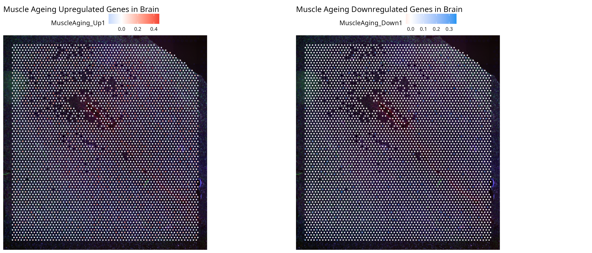
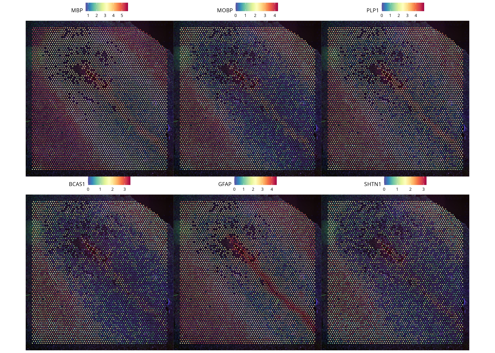

# Spatial Transcriptomics Analysis: Human Brain Ageing

Seurat-based spatial transcriptomics analysis of human brain 
tissue (10X Genomics Visium) investigating transcriptional 
heterogeneity and spatial ageing signatures.

## Biological Questions
1. What transcriptionally distinct spatial domains exist in 
   human brain tissue?
2. Where is senescence burden spatially concentrated?
3. Do skeletal muscle ageing DEGs show spatially restricted 
   patterns in brain suggesting shared cross-tissue ageing 
   programmes?

## Dataset
- **Source:** 10X Genomics V1 Human Brain Section 1
- **Platform:** Visium spatial transcriptomics
- **Spots:** ~4,900 capture spots
- **Genes:** 36,601

## Key Figures

### Spatial Clusters — UMAP and Tissue


### Cell Type Marker Genes


### Spatial Senescence Burden


### Cross-Tissue Ageing Signature


### Spatially Variable Genes


## Key Findings
- Clustering identified anatomically coherent brain regions
- MBP/MOBP expression clearly delineates white matter tracts
- Senescence burden shows spatial restriction across regions
- 11 of 13 skeletal muscle ageing DEGs are detectable in 
  brain spatial data, with spatially non-random distribution

## Methods
- Normalisation: SCTransform (Seurat v5)
- Clustering: PCA → KNN → Louvain (resolution 0.5)
- Spatially variable genes: Moran's I
- Senescence scoring: AddModuleScore (SenMayo signature)
- Cross-tissue: muscle DEGs from companion DESeq2 analysis

## Companion Analysis
See [deseq2-aging-analysis](../deseq2-aging-analysis) for the 
bulk RNA-seq analysis whose DEGs are used in Section 9.

## How to Reproduce
Open `Spatial_trasncriptomics.Rmd` in RStudio and knit.

Required packages:
\```r
install.packages("Seurat")
BiocManager::install("org.Hs.eg.db")
install.packages(c("tidyverse", "ggplot2", "patchwork"))
\```

## Reference
10X Genomics Visium Human Brain Section 1 dataset.
https://www.10xgenomics.com/datasets
